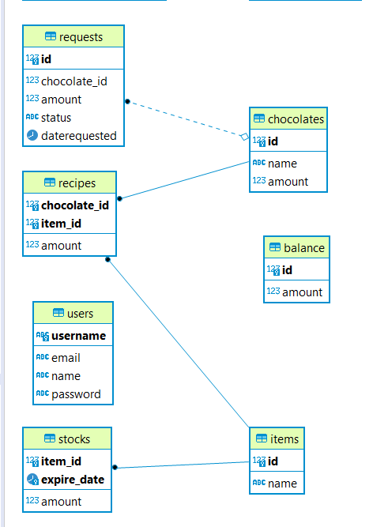

# Tugas Besar 2 - WS-Factory

## Description

-------
Merupakan layanan daring (Web service) yang menyediakan kebutuhan untuk Aplikasi Website Willy Wangky Factory dan Willy Wangky Web, dan memberikan layanan yang terkait dengan produksi dan penyimpanan stok barang coklat. 

## Database

-------
Berikut ini adalah skema database yang terdapat pada WS-Factory:

- requests
  * (id INT, chocolate_id INT, amount INT, status STRING, daterequested DATE)
  * (PK: id; FK: chocolate_id -> chocolates.id) 
- chocolates
  * (id INT, name STRING, amount INT)
  * (PK: id)
- recipes
  * (chocolate_id INT, item_id INT, amount INT)
  * (PK: chocolate_id, item_id; FK: chocolate_id -> chocolates.id, item_id -> items.id)
- balance
  * (id INT, amount INT)
  * (PK: id)
- users
  * (username STRING, email STRING, name STRING, password STRING)
  * (PK: username)
- stocks
  * (item_id INT, expire_date DATE, amount INT)
  * (PK: item_id, expire_date; FK: item_id -> items.id)
- items
  * (id INT, name STRING)
  * (PK: id)

<!-- ## Requirements

-------

1. sad
2. sa
3. dsa

## How to Compile

-------

1. sad
2. s
3. ad
4. asd

## How to Run

-------

1. sad
2. s
3. ad
4. asd

## Known Issues

-------

1. sad
2. sad
3. sad
4. sad -->

## Division of Tasks

-------

1. Database: 13518146, 13518125
2. Model: 13518146, 13518125
3. Service:
   - Auth: 13518125
   - Balance: 13518146, 13518125
   - Init: 13518146, 13518125
   - Chocolate: 13518135, 13518146, 13518125
   - Recipe: 13518146
   - Request: 13518146, 13518125
   - Stock: 13518146, 13518125
4. Setup Project: 13518146
5. CORS: 13518125
6. Testing: 13518146, 13518125, 13518135